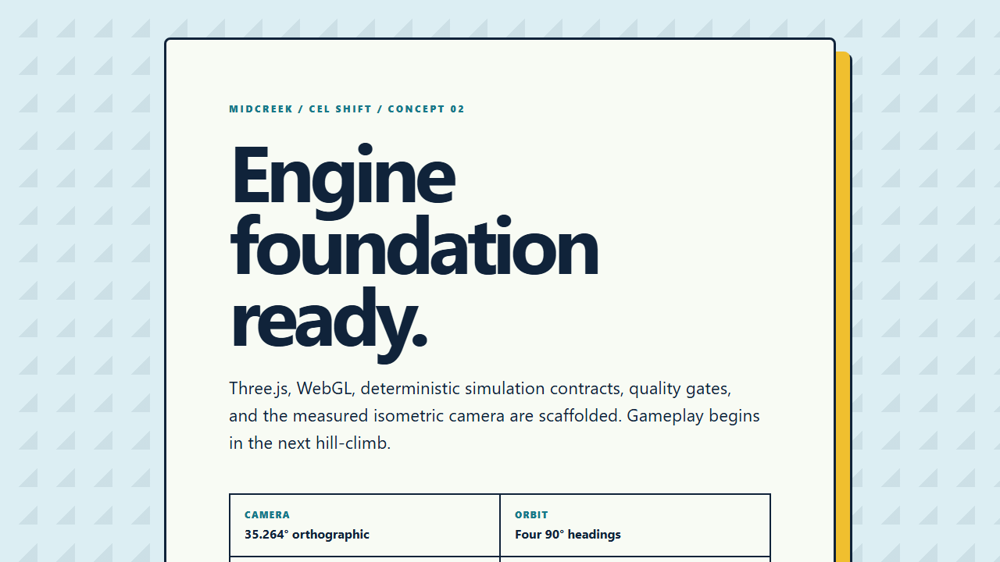
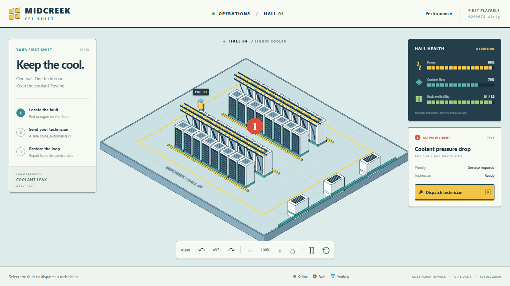
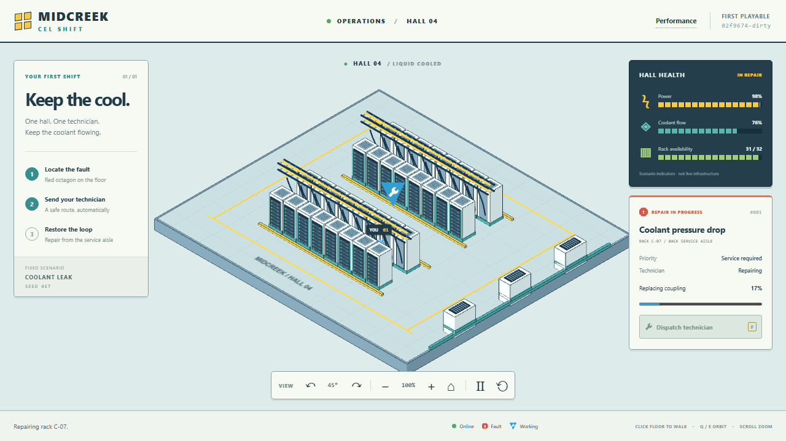
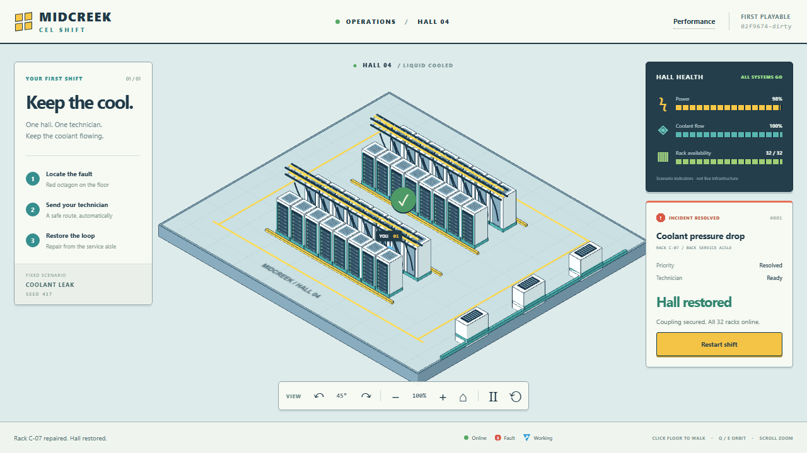

# Hill-climb protocol

Each iteration should change one measurable dimension and preserve a reproducible
comparison against the previous best.

## Required evidence

1. Fixed seed and scenario.
2. Fixed camera heading, zoom, and viewport.
3. Before/after screenshots.
4. Frame-time, draw-call, triangle, and transfer-size measurements.
5. Automated tests for changed deterministic behavior.
6. A short verdict: promote, retain for another test, or reject.

## Initial quality bars

- 60 FPS target on the Windows development VM.
- No more than 250 draw calls in the first vertical slice.
- No more than 1,000,000 visible triangles.
- No more than 15 MB initial transfer.
- No camera drift from the measured Cel Shift projection.
- Fault and work states distinguishable by both shape and color.

The first playable milestone should prove navigation, readability, and one fault
interaction before adding content breadth.

## First playable implementation / September 4, 2026

The authorized autonomous scope is the first playable milestone, not additional
content breadth. This document is the checkpoint record.

**Scenario:** `coolant-leak`, seed `417`, 1280 x 720 CSS pixels, device scale 1,
heading index `0` (45 degrees), zoom `1`. Capture each comparison with those
settings. The scaffold has no camera or renderer; its screenshot is an honest
non-playable baseline, not a performance-equivalent scene.

**Design:** Use a procedural, instanced data hall; do not bundle the reference
images. A pure fixed-tick world owns a grid, blocked rack cells, one seeded fault,
and a technician. Commands request floor destinations or dispatch the technician
to the fault. Deterministic pathfinding routes around racks. Repair requires
arrival and fixed work ticks; completion restores the hall. Pause and restart
must preserve/reproduce the scenario. Rendering and accessible DOM controls only
read snapshots. Camera orbit uses the four measured headings, bounded zoom, and
no tilt. Read-only diagnostics expose the actual render and timing measurements.

Alternatives considered: a static illustrated mockup cannot prove gameplay;
importing detailed assets adds transfer and pipeline risk before proving the
loop. Procedural geometry is the smallest reproducible playable approach.

### Checkpoints and validation loop

1. Capture the existing scaffold and run existing baseline tests/build.
2. Add failing deterministic tests in `src/world` for seeded replay, collision,
   reachable service aisles, repair timing, pause, and restart; implement the pure
   world. Add camera tests for every heading, zoom bounds, and resize.
3. Add a failing browser acceptance test in `tests/e2e`; implement scene, input,
   HUD, lifecycle, and diagnostics through `src/app`. Prove click-to-walk,
   dispatch, active work, completion, restart, and camera controls in a real
   WebGL browser. Use the existing Vitest and Playwright runners.
4. Record fixed-view before/after screenshots and actual frame-time, draw-call,
   triangle, and initial-transfer measurements. Change only a measured dimension
   in subsequent tuning iterations; record a promote/retain/reject verdict.
5. Obtain an independent Rubber Duck review, fix actionable findings with
   regressions, run `npm run check` and `npm run test:e2e`, and integrate.
6. Publish through the existing Pages workflow and verify the exact deployed
   commit and the repair loop on the public site.

Completion requires a playable navigation/readability/repair loop, reproducible
evidence, all non-timing budgets met, explicit reporting of the measured 60 FPS
target (never substituted with draw-call estimates), and current live gameplay.

## Checkpoint results / September 4, 2026

The scaffold's missing Dispatch button was observed as a failing Playwright test
before implementation. Deterministic world, camera, input, and measurement
regressions were added before their implementations. The promoted build passes
21 Vitest cases and six browser cases covering the actual repair loop, pointer
and keyboard navigation, orbit/zoom, pause, restart, narrow layout, invalid seed
errors, and WebGL context-loss recovery.

Independent Rubber Duck reviews identified and resolved: renderer versus browser
viewport reporting, counting late requests as initial payload, rebuilding an
unchanged route every simulation tick, incomplete dirty-build detection, and
missing CI build-identity enforcement. Route identity and initial-transfer
regressions were observed red before their fixes. The initial context-loss
recovery and viewport browser regressions were also observed red before fixes.

### Measured hillclimbs

All captures use the scenario, seed, heading, zoom, and 1280 x 720 browser
viewport specified above. The actual renderer occupies 1280 x 600 CSS pixels.
Except for the explicitly labeled raster experiment, device scale and renderer
pixel ratio are both 1. Samples are the last 300 visible animation frames.
Figures below are measured, not estimated from geometry counts.

| Iteration         | Changed dimension                                   | Mean FPS | Median / p95 ms | Calls | Triangles | Initial bytes | Verdict                                              |
| ----------------- | --------------------------------------------------- | -------: | --------------- | ----: | --------: | ------------: | ---------------------------------------------------- |
| 00 scaffold       | No renderer (180 samples)                           |     60.0 | 16.7 / 16.7     |     0 |         0 |         2,916 | Baseline only; not comparable gameplay               |
| 01 playable       | Navigation and one repair loop                      |     24.8 | 33.4 / 50.1     |    28 |    20,052 |       151,075 | Promote playability; timing target unmet             |
| 02 no MSAA        | Antialiasing only                                   |     37.0 | 33.3 / 33.4     |    28 |    20,052 |       151,097 | Reject: jagged outlines, still below target          |
| 03 planar details | Flat server faces use two triangles                 |     36.7 | 33.3 / 33.4     |    28 |    12,372 |       151,165 | Promote geometry reduction, not an FPS claim         |
| 04 75% raster     | Renderer pixel ratio only, 0.75                     |     41.0 | 16.8 / 33.4     |    28 |    12,372 |       151,169 | Reject: blurred fine details, still below target     |
| 05 promoted       | Restore native raster and MSAA; keep planar details |     26.4 | 33.4 / 50.0     |    28 |    12,372 |       151,169 | Promote fidelity and gameplay; retain timing blocker |

Paired PNG and JSON files for every row live in `docs/evidence/`. Iterations
01-04 were captured in the working tree based on `02f9674`; their old build stamp
is the base revision, not a claim that the scaffold commit contained gameplay.
The final candidate includes a `-dirty` suffix until committed; deployments stamp
the actual checked-out commit, which browser acceptance checks must match.






### Remaining timing blocker

**The 60 FPS target is not met on this development VM.** Windows exposes only
`Microsoft Hyper-V Video`; Chromium reports ANGLE Vulkan **SwiftShader**, a
software renderer. Enabling the Chromium hardware-GPU flag still selected
SwiftShader (26.9 FPS in that probe). Do not describe these results as a
hardware-GPU pass, and do not infer FPS from the low 28-call / 12,372-triangle
counts. All draw-call, triangle, and transfer limits are met.

Three bounded experiments isolated antialiasing, geometry, and raster-area
costs. None reached 60 FPS. The two fidelity regressions were rejected instead
of hiding the shortfall with a lower-resolution default, skipped renderer
updates, or a fake FPS counter. Further content breadth is not the next step:
run the same capture on a hardware-accelerated Windows browser before choosing
a deeper rendering change.

### Published gameplay checkpoint

Gameplay commit `40976cf` was integrated into `main` and deployed to
<https://ridermw.github.io/midcreek-cs-2/>. Pages run `33922403443` and Quality run
`33922403453` both completed successfully. The same six browser acceptance
cases then passed against the **public site**, with `EXPECTED_BUILD_SHA=40976cf`,
including dispatch, arrival, active repair, completion, restart, camera controls,
pointer movement, pause, narrow layout, and graphics-loss recovery.

This is a playable release, **not** a declaration that the 60 FPS quality bar
passed. The remaining action is the hardware-accelerated timing comparison
described above. Documentation-only commits can advance the build stamp after
this gameplay checkpoint; the header and Pages workflow identify the current
deployed revision.

The explicit target gate is intentionally separate from deterministic CI:

```powershell
npm run build
$env:CHECK_FRAME_TARGET = '1'
npm run test:e2e -- tests/e2e/performance.spec.ts
Remove-Item Env:CHECK_FRAME_TARGET
```

It fails below 59 measured mean FPS or above 18 ms p95 (one FPS tolerance for
refresh-clock quantization). Ordinary CI does not falsely mark that hardware
target as passed. Pages deployment is gated on formatting, lint, deterministic
tests, build, real WebGL gameplay acceptance, and exact build identity.
